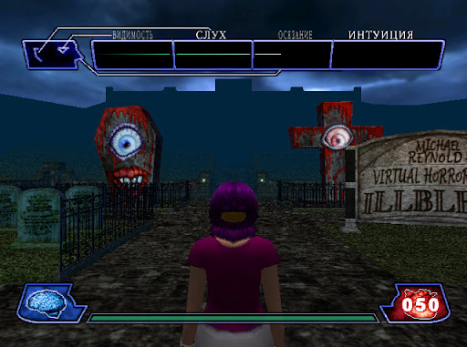
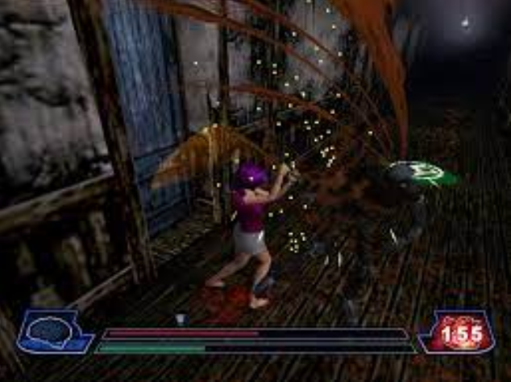
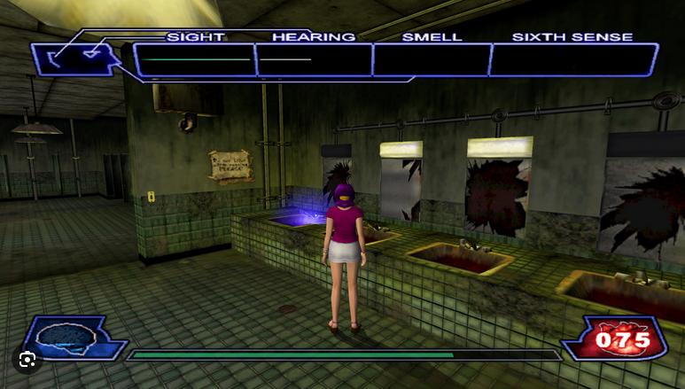
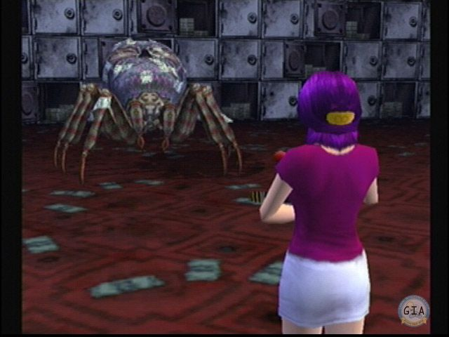
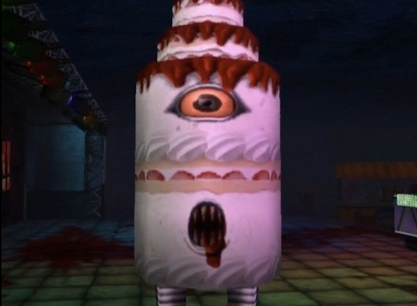
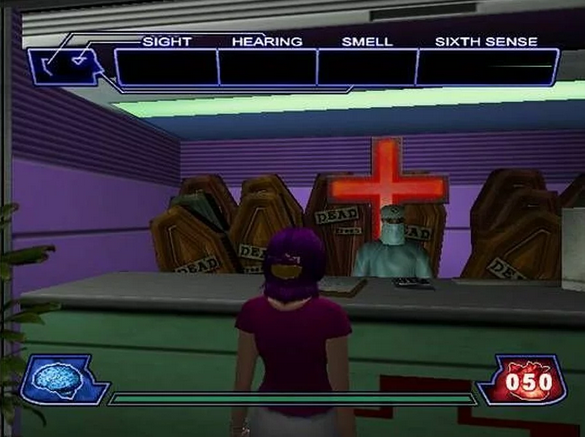

# 🎪 FearPark: Ill‑Senses — подробная концепция

## 🎯 Краткий питч

- 🎬 **Кооперативный хоррор-аттракцион в духе B‑movie**: парк ужасов с эпизодами, где игроки без подсказок на старте учатся «чувствовать» ловушки и угрозы, развивая органы восприятия через «операции» в Клиниках Чувств.
- ⚡ **Основной кайф** — постепенный переход от полной беспомощности к «шестому чувству» через скилл и мета-прогресс, плюс адреналиновые кульминации и гротескный юмор.

## 👥 Целевая аудитория и формат

- 🎂 **Возраст**: 10–16 (core), 16+ (nostalgia/кооп)
- 🎮 **Формат**: Соло и кооп 1–4 игрока. Матч 8–15 минут
- 💖 **Вкусовые предпочтения**: хоррор без натуралистики, загадки, командная синхронизация, умеренный челлендж

## 🏗️ Дизайн-столпы

1. 👁️ **Научись видеть невидимое** — «чувства» как геймплей и прогресс
2. 🤝 **Командная синхронизация** — несколько ролей, совместное сканирование, спасение  
3. 🎭 **B‑movie стиль** — гротеск, ирония, намеренная кичевость
4. 💎 **Честная монетизация** — ускорение и косметика без прямого «вижу всё»
5. 🔄 **Сессионность и реиграбельность** — ротация аттракционов, процедурные комнаты

## 🧭 Вдохновение

- Идея проекта основывается на игре Illbleed (2001, Dreamcast): парк ужасов как набор аттракционов‑фильмов, акцент на «чувствах» игрока и B‑movie эстетике.
- Мы переосмысливаем эти принципы для кооператива (1–4 игрока), расширяя систему телеграфов, мета‑прогресс и современную кинематографичность.

## 🌟 Лор и сеттинг

- 🎪 **Парк «Ill‑Senses»** — набор аттракционов‑фильмов, курируемых эксцентричным «Директором». Между забегами — «Клиника Чувств», где персонажи проходят операции, усиливающие восприятие.
- 🎬 **Аттракционы** — самостоятельные «фильмы» с уникальными правилами, ловушками и боссами.

## ⚙️ Core loop (3–5 минут)

1. 🚪 **Вход в аттракцион** → разведка (нет подсказок на T0)
2. 🔍 **Детект и обход ловушек** с помощью зачаточных сигналов и предметов
3. 🎯 **Выполнение мини-задач**: отключение капканов, поиск ключей, спасение NPC
4. 💥 **Кульминация**: босс/погоня/таймер; сдать цель
5. 🏆 **Награда** → Лобби → Операции в Клиниках → усиление «чувств» → повтор

## 🧬 Мета-прогресс: Операции в Клиниках Чувств

- 🎛️ **Выбор**: игрок выбирает орган (Слух, Зрение, Обоняние, Интуиция) и профиль риска (Безопасно/Стандарт/Рискованно)
- 💰 **Стоимость**: мягкая валюта + материалы; мини‑испытание (ритм/точность/стабильность) определяет качество результата
- 📈 **Результат**: повышение уровня соответствующего «чувства», редкий шанс «побочки» (временный минорный дебафф, лечится отдыхом/расходником)
- ⏳ **Ограничители**: кулдаун на повторную операцию одного органа; очереди операций

## 🧠 Система «Чувств» и уровни телеграфов

💡 **Общий принцип**: начальный T0 — ноль подсказок; с ростом — от едва заметных намёков к аккуратным, но не тотальным подсветкам. Верхние уровни дают информацию, не превращающую игру в авто‑пилот.

### 👂 Слух
- **T0**: 🚫 нет сигналов
- **T1**: 🔉 редкие слабые пульсы риска на близкой дистанции  
- **T2**: 🎵 частота и лёгкий стерео‑сдвиг указывают, с какой стороны опасность
- **T3**: 📍 краткий «пинг»-сектор направления
- **T4**: 🎯 стабильная арка‑указатель и чуть больший радиус
- **T5**: ⚠️ тип опасности и примерный тайминг, но без точной позиции

### 👁️ Зрение  
- **T0**: 🚫 ничего
- **T1**: ✨ «микро‑искры» над активной зоной, видимые на месте
- **T2**: 👻 краткий контур при остановке
- **T3**: 🔍 полупрозрачный контур при движении, повышенная точность
- **T4**: 🌈 цветовая кодировка опасности
- **T5**: 🛤️ подсказка безопасной траектории короткими вспышками

### 👃 Обоняние
- **T0**: 🚫 ничего
- **T1**: 💨 слабые шлейфы частиц от химических/кровавых зон
- **T2**: 🏷️ иконка‑тег при удержании стойки/концентрации
- **T3**: 🌬️ направление «ветра» и смещение газов
- **T4**: 📏 рекомендуемая дистанция
- **T5**: ⭕ визуализация радиуса активации

### 🔮 Интуиция
- **T0**: 🚫 ничего
- **T1**: 🤔 редкие «сомнения» в опасных комнатах
- **T2**: 🎲 небольшой шанс автодетекта при входе в комнату
- **T3**: 🧩 подсказки паттернов (например, «каждый N‑й манекен живой»)
- **T4**: 😱 низкий шанс предупредить о скример‑триггере
- **T5**: 🗺️ редкий «предвидящий пинг» комнаты (совет по маршруту)

## 💗 Статусы персонажа

- ❤️ **Здоровье**, 🩸 **Кровотечение**, 💓 **Стресс/Пульс**, 🎯 **Фокус**  
- 📊 **Стресс** влияет на читабельность сигналов и управляемость  
- 🩸 **Кровотечение** — мягкий урон со временем и визуальные эффекты

## 🎭 Роли и кооп‑синергии

### 👨‍⚕️ Специализации
- 🏥 **Медик** (снижает побочки, лечит кровотечение)
- 🔧 **Технарь** (обезвреживание быстрее)  
- 🕵️ **Разведчик** (улучшенные временные телеграфы)
- 👤 **Луркер** (приманка/байт на мобов)

### 🤝 Командные синергии
- 🔄 **Совместный скан**: наложение чувств нескольких игроков повышает точность на короткое время
- 🆘 **Рескью‑системы**: поднятие союзников уменьшает командный стресс и даёт временную устойчивость к скримерам

## 🎨 Концепт‑арты и визуальные референсы

Для выстраивания общего понимания атмосферы и стилистики используем набор ключевых концепт‑артов и мудбордов:
- Общий тон: B‑movie, неон, туман, контровой свет. 

- Дым, тёпло‑холодная палитра, пепел. 
 

- Материалы: резина/пластик/пыль, нарочито «дешёвые» стыки. 
 

- Стерильный сюр, хирургический свет и ретро‑техника. 

Примечание: изображения ожидаются в папке docs/art; имена файлов — ориентиры и могут быть заменены на актуальные.

## 🎪 Контент первого сезона

### 🎢 6 аттракционов:

1. 🎵 **«Сгоревший дом»**: история про сгоревшую семью и выжившего изуродованного отца
2. TODO
3. TODO
4. TODO
5. TODO
6. TODO

### 👹 Враги и боссы
- 🤖 **Враги**: аниматроники, резиновые монстры, манекены‑убийцы
- 📡 **Поведение** телеграфируется через «чувства»
- 👑 **Боссы**: имеют читаемые телеграфы, контрплей строится на интерпретации сигналов

Ловушки и угрозы
- Напольные/настенные/воздушные «горячие точки», лазеры, гильотины‑муляжи, скримеры (временная дезориентация).
- «Кровавые» зоны (стилизация): повышают стресс и кровотечение.
- Системы обезвреживания: мини‑пассы на тайминг/ритм/память.

Экономика (высокоуровнево)
- Мягкая валюта: за прохождение, обнаружение ловушек без активации, контракты.
- Материалы: органы/линзы/нейро‑модули для операций.
- Премиальные покупки описаны в отдельном документе монетизации; верхние уровни чувств доступны без доната, донат — ускоритель.

LiveOps и сезоны
- Ротация аттракционов, сезонные события выходных, временные модификаторы (например, «Эхо‑неделя» — усиленный Слух).
- Сезонный пропуск: миссии, косметика B‑movie, ускорители без преимущества в бою.

Аудио/визуал/UX
- Аудио: бинауральные пульсы, тембры по типам угроз, фильтры при высоком стрессе.
- Визуал: стилизованные эффекты, без натуралистичной жести; читаемые контуры и цветовой язык.
- UX: минималистичные, обучающие на лету подсказки; журнал чувств; индикаторы стресса «дыханием» экрана.

Аналитика и метрики
- Фаннел: TutorialStart → FirstTrapSpotted → FirstOperation → T2Sense → FirstBossClear → CoopPlay.
- KPI: завершение FTUE ≥70%, средняя сессия 10–12 мин, D1 30–35%, D7 8–12%, доля кооп‑сессий ≥25%.
- Ивенты: TrapDetected, TrapTriggered, OperationStarted/Completed, SideEffectApplied/Healed, BossClear.

Риски и смягчение
- Сложность чтения телеграфов: поэтапное обучение, режим практики, усиленные подсказки для новичков.
- Токсичный кооп: мягкие штрафы за лив, позитивное подкрепление за помощь.
- Баланс доната: верхние уровни чувств достижимы игрой; платные ускорители капнут.
- Правовые аспекты: создаём оригинальные ассеты в стилистике B‑movie; не используем чужие текстуры/аудио без лицензии.

Технический подход (без кода)
- Сервер‑авторитетный расчёт урона/наград/ловушек.
- Модульные комнаты/чанки с конфигами ловушек и семенами.
- Профили игроков: уровни чувств, побочки, очереди операций, инвентарь материалов.
- Анти‑чит: валидация вызовов, лимиты частоты, серверные кулдауны, репликация результатов вместо источников.
